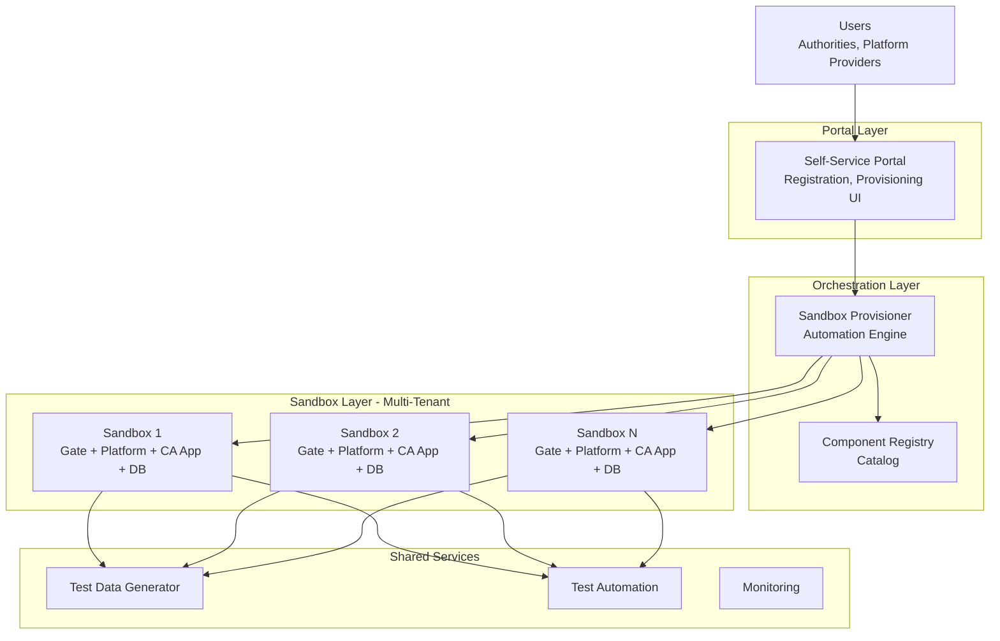
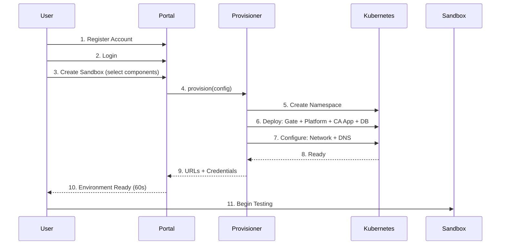
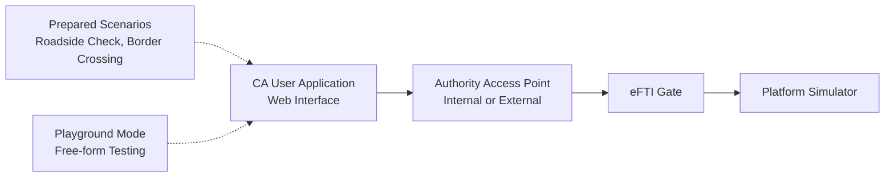
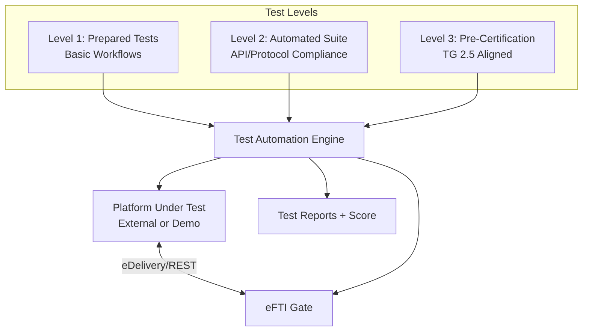

# eFTI Testbed Architecture

**Version:** 0.1
**Date:** 2026-02-26
**Work Package:** WP1 - Architectural Design of Testbeds (eFTI4live TG 2.2)
**Authors:** Rainer Türner

---

## 1. What & Why

### 1.1 What We're Building

A **self-service eFTI testing platform** enabling users to create isolated testing environments in under 60 seconds via a web portal.

### 1.2 Problem Statement

**Current State:**
- Manual efti-gate deployment: Clone repo → Configure → Build → Deploy → Test (hours to days)
- No isolated testing environments
- High technical barrier

**Target State:**
- Automated provisioning: Register → Select components → Click → Test (60 seconds)
- Isolated multi-tenant sandboxes
- Zero technical setup required

### 1.3 Scope

Per eFTI4live TG 2.2, Work Package 1:
- Self-service portal for environment provisioning
- Testbed for Authorities (CA-Side) - prepared tests and playground
- Testbed for Economic Operators (EO-Side) - platform testing and pre-certification

### 1.4 Foundation

Built on **KeMIT's efti-gate** (eftisandbox.eu: eu-ee31, eu-ee32):
- Proven performance: 715,570 requests in 15 minutes (Test Fest 3)
- Production-ready: Kotlin/Klite, PostgreSQL, Svelte
- Alternative to slow EU reference implementation

---

## 2. System Overview

### 2.1 Architecture Layers



### 2.2 User Journey



**Key Concept - Sandbox:** Isolated environment with dedicated Gate, Platform, CA App, and Database. Complete network isolation between users.

### 2.3 Multi-Tenancy Model

| Aspect | Implementation |
|--------|---------------|
| **Isolation** | Kubernetes namespace per sandbox |
| **Networking** | Network policies prevent cross-sandbox traffic |
| **Data** | Separate PostgreSQL instance per sandbox |
| **DNS** | Unique URL paths: `eftisandbox.eu/{user}-{id}` |
| **Resources** | CPU/RAM limits enforced per sandbox |
| **Lifecycle** | Auto-stop (4h idle), auto-delete (7 days) |

---

## 3. Core Components

### 3.1 Portal

**Purpose:** User-facing interface for testbed access and management

**Responsibilities:**
- User registration and authentication
- Sandbox creation wizard (component selection)
- Environment lifecycle management (start/stop/delete)
- Resource usage monitoring
- Documentation access

**Technology:** Svelte (frontend) + Kotlin/Klite (backend) + PostgreSQL

**Key Interfaces:**
- → Provisioner: trigger sandbox creation
- → Monitoring: display metrics
- ← User: web browser (HTTPS)

### 3.2 Provisioner

**Purpose:** Automation engine for sandbox provisioning

**Responsibilities:**
- Parse user configuration
- Validate resource quotas
- Generate Kubernetes manifests (or Docker Compose)
- Orchestrate container deployment
- Configure networking and DNS
- Initialize databases with test data

**Technology:** Kubernetes Operator (production) or Docker API (development)

**Key Interfaces:**
- ← Portal: provisioning requests
- → Kubernetes: namespace + pod creation
- → Component Registry: fetch component specs
- → DNS: URL path configuration

**Performance Target:** <60 seconds from request to ready

### 3.3 Sandbox

**Purpose:** Isolated testing environment for single user/session

**Components per Sandbox:**
- **eFTI Gate:** KeMIT efti-gate instance
- **Platform:** Demo platform or user's external platform
- **CA Application:** Authority user interface (optional)
- **PostgreSQL:** Dedicated database instance
- **Network:** Isolated namespace with ingress

**Resource Allocation:**
```
CPU: 500m (requested) → 2000m (limit)
RAM: 1Gi (requested) → 4Gi (limit)
Storage: 20Gi (persistent volume)
```

**Lifecycle States:**
- `creating` → `running` → `stopped` → `deleting`

### 3.4 Shared Services

| Service | Purpose | Technology |
|---------|---------|------------|
| **Test Data Generator** | Synthetic consignment data generation | Kotlin service + Faker library |
| **Test Automation Engine** | Execute test suites, collect results | JUnit 5 + Kotlin HTTP client |
| **Pre-Certification Suite** | TG 2.5 aligned compliance tests | Test framework + validators |
| **Monitoring Stack** | Metrics, logs, alerts | Prometheus + Grafana + Loki |
| **Documentation** | User guides, API reference | Static site (Docusaurus/MkDocs) |

**Key Interface:** All sandboxes access shared services via internal APIs

---

## 4. Two Testing Tracks

### 4.1 CA-Side: Authority Testing

**Target Users:** Competent Authorities (police, customs, transport inspectors)

**Purpose:** Train authority personnel on eFTI query workflows

**Architecture:**



**Components:**
- **CA User Application:** Simulates control station operations (query by vehicle plate, UIL, date)
- **AAP Options:** Internal (built into gate) or External (separate simulator for complex auth)
- **Prepared Scenarios:** 10+ guided test cases (e.g., roadside weight check, dangerous goods inspection)
- **Playground:** Manual query construction for advanced users

**Integration (WP4):**
- Germany provides: BALM/Toll Collect specific scenarios (YAML format)
- Estonia integrates: Scenarios into CA-Side testbed component registry

### 4.2 EO-Side: Platform Testing

**Target Users:** Platform providers, software developers, system integrators

**Purpose:** Validate platform implementations, achieve pre-certification readiness

**Architecture:**



**Test Levels:**

| Level | Purpose | Tests | Output |
|-------|---------|-------|--------|
| **1. Prepared** | Basic workflow validation | Identifier publishing, query response | Pass/Fail per workflow |
| **2. Automated** | API/protocol compliance | 50+ automated tests (API, data model, performance) | Detailed test report |
| **3. Pre-Certification** | TG 2.5 readiness | Tier 1 (apps), Tier 2 (ops), Tier 3 (network) | Readiness score 0-100% |

**Pre-Certification Output:**
- **Score:** 0-100% (≥90% = ready for certification)
- **Gap Analysis:** What needs fixing before official certification
- **Compliance Matrix:** Pass/fail per requirement

**TG 2.5 Integration:**
- Estonia provides: Test framework, test suites, result format (JSON)
- TG 2.5 uses: Building blocks for official platform certification process

---

## 5. Critical Decisions

| Decision | Options Considered | Choice | Rationale |
|----------|-------------------|--------|-----------|
| **Foundation** | EU reference impl vs KeMIT efti-gate | **efti-gate** | 10x+ performance, proven in Test Fest 3, production-ready |
| **Orchestration** | Docker Compose, Docker Swarm, Kubernetes | **Kubernetes** | Multi-tenancy, scalability, cloud-agnostic, industry standard |
| **Isolation** | Shared resources, VMs, containers | **K8s namespaces** | Lightweight, fast provisioning, cost-effective |
| **Frontend** | React, Vue, Svelte | **Svelte** | Consistency with efti-gate, small bundle, reactive |
| **Backend** | Java/Spring, Node.js, Kotlin/Klite | **Kotlin/Klite** | Consistency with efti-gate, performance, simplicity |
| **Database** | MySQL, MongoDB, PostgreSQL | **PostgreSQL** | Proven in efti-gate, JSONB support, reliability |
| **DNS Strategy** | Random domains, custom domains | **eftisandbox.eu** | Leverage existing infrastructure, user trust |
| **Ingress** | Nginx, Traefik, Caddy | **Caddy** | Automatic HTTPS, simple config, modern |

---

## 6. Deployment Scenarios

| Aspect | Development (VPS) | Production (Kubernetes) | Scale (Multi-Region) |
|--------|-------------------|------------------------|---------------------|
| **Use Case** | Initial dev, small tests | Public launch, EU-wide | High availability, 100+ users |
| **Infrastructure** | Single VPS | Managed K8s (3-5 nodes) | Multi-region clusters |
| **Orchestration** | Docker Compose | Kubernetes + Helm | K8s + Global LB |
| **Concurrent Users** | <10 | 50+ | 100+ |
| **Concurrent Sandboxes** | 5-10 | 50+ | 100+ |
| **Cost/Month** | €50-100 | €300-500 | €1000+ |
| **Availability** | Single point of failure | 95%+ (multi-node) | 99%+ (multi-region) |
| **Complexity** | Low | Medium | High |
| **Example** | Like eu-ee31.eftisandbox.eu | Production testbed | Critical infrastructure |

**Recommended Path:** Dev (Phase 1-2) → Production (Phase 3-4, public launch) → Scale (if needed post-2027)

**DNS Structure (eftisandbox.eu):**
- Portal: `testbed.eftisandbox.eu`
- Sandboxes: .eftisandbox.eu/{user}-{id}` (e.g., `eftisandbox.eu/alice-sb001`)
- API: `api.eftisandbox.eu`
- Docs: `docs.eftisandbox.eu`

---

## 7. Integration Points

### 7.1 Collaboration (WP4 ↔ WP5)

**Interface: CA Test Scenarios**

Germany provides:
```yaml
# Example scenario format
scenario:
  id: "de-balm-roadside-check"
  name: "BALM Roadside Weight Check"
  authority: "BALM"
  country: "DE"
  steps:
    - action: "search_by_vehicle_plate"
      input_format: "DE-XX-1234"
    - action: "request_dataset_subset"
      subset: "weight_and_dimensions"
  test_data: "german-truck-consignment"
```

Estonia integrates:
- Load scenarios into component registry
- Map to CA User Application workflows
- Generate test data per scenario spec

**Coordination:** Monthly sync meetings, shared Git repository

### 7.2 TG 2.5 Certification (Building Blocks)

**Interface: Pre-Certification Test Results**

Estonia provides:
```json
{
  "test_run_id": "uuid",
  "platform_id": "platform-xyz",
  "timestamp": "2026-03-15T10:30:00Z",
  "tier": 1,
  "total_tests": 45,
  "passed": 42,
  "score": 93.3,
  "certification_ready": true,
  "gaps": [
    {"test_id": "app-002", "severity": "medium"}
  ]
}
```

TG 2.5 uses:
- Test framework architecture
- Test suite definitions (Tier 1, 2, 3)
- Result format specification
- Pre-certification reports

**Coordination:** Regular liaison with TG 2.5, feedback loop on certification criteria

### 7.3 Work Package Coordination

| WP | Owner | Deliverable | Interface to WP1 |
|----|-------|-------------|------------------|
| **WP1** | **Estonia** | Testbed architecture | This document |
| **WP2** | Germany | Cloud infrastructure | Infrastructure requirements spec |
| **WP3** | **Estonia** | efti-gate maintenance | Docker images, release notes |
| **WP4** | Germany | CA test scenarios | YAML scenario format |
| **WP5** | **Estonia** | Platform test suites | Test suite API, JSON result format |
| **WP6** | Shared | TG 2.5 coordination | Test framework + results |

---

## 8. Technology Stack

### 8.1 Core Technologies

| Layer | Component | Technology | Source |
|-------|-----------|------------|--------|
| **Frontend** | Portal UI | Svelte 4 + TypeScript | Inherited |
| **Frontend** | CA User App | Svelte 4 + TypeScript | Inherited |
| **Backend** | Portal API | Kotlin 1.9 + Klite | Inherited |
| **Backend** | Gate | Kotlin 1.9 + Klite | Inherited |
| **Backend** | Provisioner | Kotlin 1.9 | New |
| **Database** | All data storage | PostgreSQL 15+ | Inherited |
| **Containers** | Runtime | Docker 24+ | Inherited |
| **Orchestration** | Multi-tenancy | Kubernetes 1.28+ | New |
| **Packaging** | K8s manifests | Helm 3 | New |
| **Ingress** | Load balancing | Caddy | New |
| **Monitoring** | Metrics | Prometheus 2.x | New |
| **Monitoring** | Visualization | Grafana 10.x | New |
| **Monitoring** | Logging | Loki 2.x | New |
| **Storage** | Test data | S3-compatible (MinIO) | New |

### 8.2 Why These Choices?

**Inherited (from efti-gate):**
- Proven in production (eu-ee31, eu-ee32)
- Performance validated (Test Fest 3)
- Team expertise

**New (for testbed):**
- Industry standards (Kubernetes, Prometheus)
- Cloud-agnostic (no vendor lock-in)
- Modern, simple (Caddy vs complex Nginx configs)

---

## 9. Success Criteria

### 9.1 Technical Metrics

| Metric | Target | Measurement |
|--------|--------|-------------|
| Sandbox provisioning time | <60 seconds | 95th percentile |
| System uptime | >95% | Monthly availability |
| Concurrent sandboxes | 50+ | Load tested |
| Portal response time | <2 seconds | 95th percentile |
| Gate query response | <50ms | Median (local query) |

### 9.2 Adoption Metrics (Month 24)

| Metric | Target |
|--------|--------|
| Registered users | 150+ |
| Sandboxes created (total) | 2,000+ |
| Tests executed (total) | 20,000+ |
| Platforms pre-certified | 15+ |
| Authorities trained | 10+ |
| User satisfaction | >4/5 |

---

## 10. Risk Management

| Risk | Impact | Mitigation |
|------|--------|------------|
| **Spec changes (v0.9X)** | High | Modular architecture, clear update points |
| **Resource costs exceed budget** | High | Auto-scaling, aggressive cleanup, cost monitoring |
| **Coordination delays** | Medium | Clear interfaces, async work possible |
| **TG 2.5 requirements unknown** | Medium | Extensible framework, regular coordination |
| **User adoption slow** | Medium | Good UX, documentation, industry partnerships |
